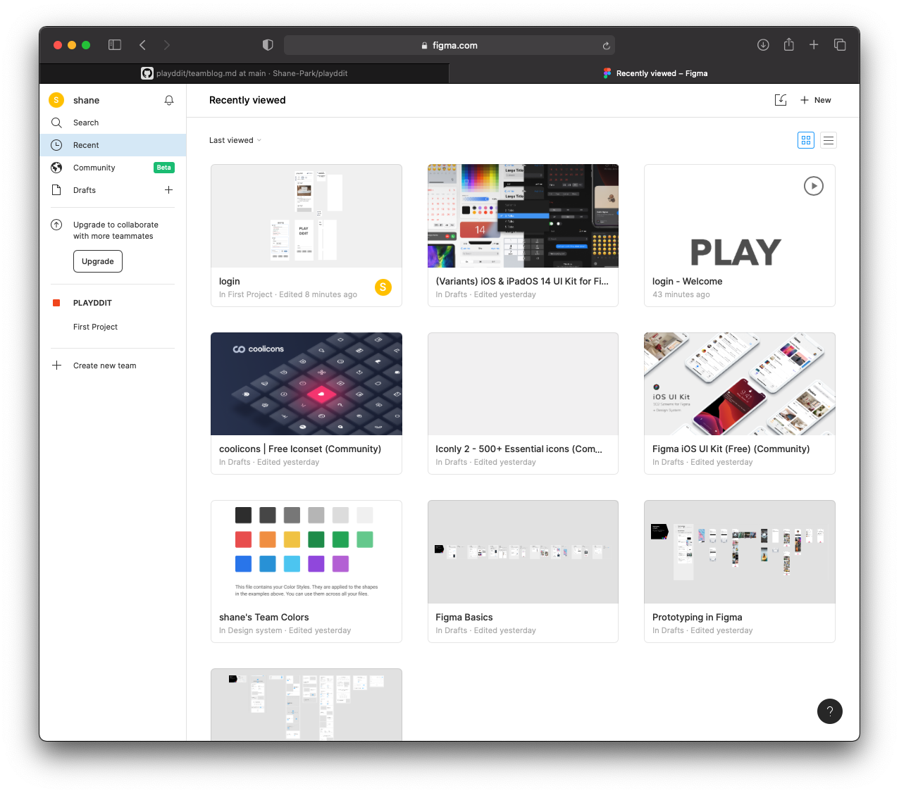
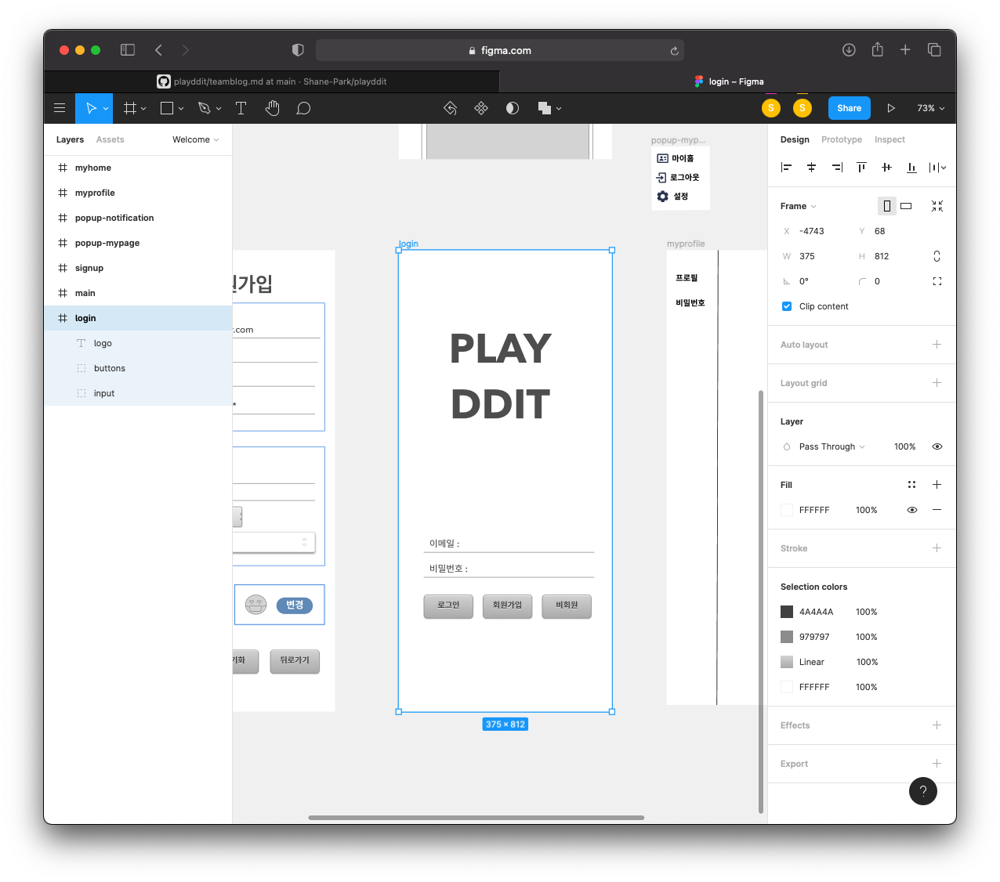
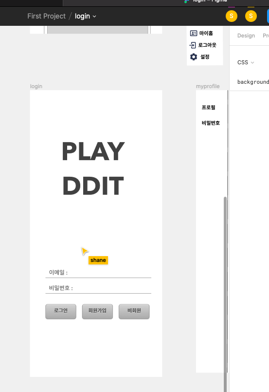
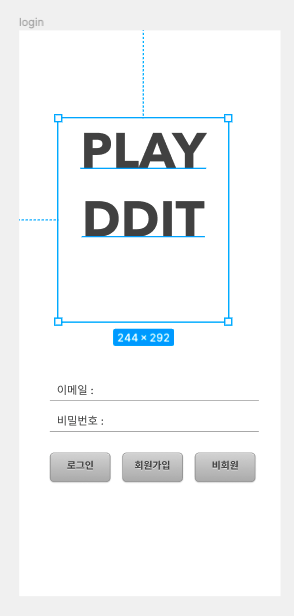
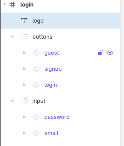
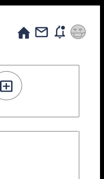
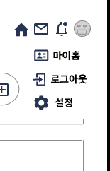
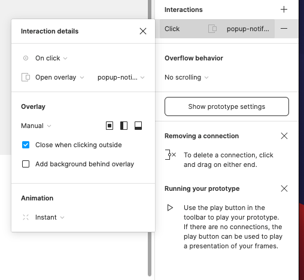

# Figma 사용하기
 

> Figma는 UI/UX design 프로토타이핑 툴 입니다.    
처음에는 sketch 무료 1개월 체험을 이용해 프로젝트를 진행해보려고 했습니다.    
디자인이나 웹쪽에 전혀 지식이 없었어도 어렵지 않게 어느 정도 활용 할 수 있길래 sketch를 사용하려고 했지만   
프로젝트 팀에서 혼자만 맥을 사용하다 보니, 협업에서 더 유리한 프로그램을 찾다 Figma를 선택하게 되었습니다.    
일단 불과 한시간 정도의 분량이지만 sketch 에서 작업한 .sketch 파일을 바로 불러 올 수 있다는게 크게 매력적으로 다가왔습니다.

>처음 가입을 하고 프로젝트를 생성하면 이런 화면이 나옵니다.   
Community에서 버튼이나 아이콘 등 다른 이용자들이 만들어 무료로 배표해둔 자료들을 손쉽게 이용할 수 있는것도 마음에 듭니다.

> 연습용으로 작업해 봤던 메인 로그인 화면입니다.

  
'layer'라 불리는 큰 도화지에 여러개의 Frame들을 만들 수 있습니다.  

>각각의 frame 들은 Prototype 기능을 통해 연결될 수 있습니다.

>Inspect를 누르면 폰트, 사이즈, 컬러정도 및 css 코드 정보도 확인 할 수 있습니다.

>우측 상단의 두개의 S는 지금 프로젝트에 접속중인 탐원들을 의미합니다. 지금은 제가 같은 계정으로 하나는 Figma 앱, 하나는 safari 웹을 통해 접속해 제가 2개의 접속을 하고 있는 것으로 나옵니다. 팀원이 작업중인 내용이 바로바로 반영되는것은 물론, 팀원의 마우스 위치도 실시간으로 확인 할 수 있습니다.    
이 시간이 마음에 들면 마우스를 흔들어주세요! 등도 액션도 협업에서 가능합니다. 플러그인을 설치하면 채팅하는 기능도 지원합니다.

> 각각의 '프레임'에서 작은 요소들을 그룹화 할 수도 있습니다.   
'#login' 프레임에 웹사이트 로고, 입력하는 legend들의 그룹, 그리고 버튼들의 그룹이 있습니다. 
'버튼'그룹은 또한 login, signup, guest 버튼들이 그룹화 되어 있습니다.

>프로토타입을 실행해 보아서 각 버튼 실행시 작동하는 것도 확인해 볼 수 있습니다.

>위의 내용은 다음과 같이 클릭 할 경우에 overlay를 오픈해 popup_notification 프레임을 열도록 하였습니다.   
On click 외에 while hovering 으로 비슷한 효과를 낼 수도 있지만, 마우스가 떠날때 창이 꺼져서 불편할 수 있습니다.   
다만, click 이벤트로 지정 했다면 close when clicking outside를 지정해 주는 것이 좋습니다.

아직 하루밖에 안써봤지만, 꽤나 좋은 툴인 것 같습니다. 무엇보다도 개인 사용시엔 거의 무료라는 점도 매우 매력적입니다.